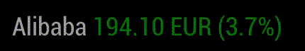
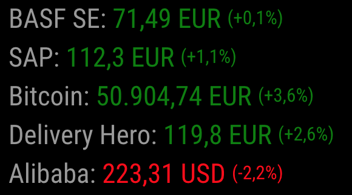

# MMM-JaST - **J**ust **a**nother **S**tock **T**icker

[](https://github.com/jalibu/MMM-Jast/releases) [](https://snyk.io/test/github/jalibu/MMM-Jast?targetFile=package.json)

This is a minimalistic stock ticker based on Yahoo's finance API for the [MagicMirror²](https://magicmirror.builders/) platform.  
Click here for the Magic Mirror [Forum Thread](https://forum.magicmirror.builders/topic/12507/mmm-jast-just-another-stock-ticker).

Contribution welcome.

### Support

I put a lot of time and effort into the creation and maintenance for this module and I'm glad so many people like it.  
If you also like this module and want to thank, please rate this repository with a star or [donate a small amount that is worth it to you](https://paypal.me/jalibu).

## Features

- Uses Yahoo Finance API to collect current
  - stock values
  - indexes
  - cryptocurrencies
- No API Key required
- Vertical or horizontal scrolling or static list
- Share Portfolio value and growth summary
- Very customizable
- Easy to use

Horizontal  


Vertical  


Static  


## Installing the Module

1. Navigate to the `MagicMirror/modules` directory and execute the following command

   ```sh
   git clone https://github.com/jalibu/MMM-Jast.git
   ```

2. Change into the MMM-Jast module folder and install runtime dependencies with

   ```sh
   cd MMM-Jast
   npm install --only=production
   ```

3. Add the module configuration into the `MagicMirror/config/config.js` file (sample configuration):

   ```javascript
   {
   	module: "MMM-Jast",
   	position: "top_left",
   	config: {
   		currencyStyle: "code", // One of ["code", "symbol", "name"]
   		fadeSpeedInSeconds: 3.5,
   		lastUpdateFormat: "HH:mm",
   		maxChangeAge: 1 * 24 * 60 * 60 * 1000,
   		maxWidth: "100%",
   		numberDecimalsPercentages: 1,
   		numberDecimalsValues: 2,
   		scroll: "vertical", // One of ["none", "vertical", "horizontal"]
   		showColors: true,
   		showCurrency: true,
   		showChangePercent: true,
   		showChangeValue: false,
   		showChangeValueCurrency: false,
   		showHiddenStocks: false,
   		showLastUpdate: false,
   		showPortfolioValue: false,
   		showPortfolioGrowthPercent: false,
   		showPortfolioGrowth: false,
   		updateIntervalInSeconds: 300,
   		useGrouping: false,
   		virtualHorizontalMultiplier: 2,
   		stocks: [
   			{ name: "BASF", symbol: "BAS.DE", quantity: 10 },
   			{ name: "SAP", symbol: "SAP.DE", quantity: 15 },
   			{ name: "Henkel", symbol: "HEN3.DE", hidden: true },
   			{ name: "Alibaba", symbol: "BABA"}
   		]
   	}
   }
   ```

### Options

| Option                        | Description                                                                                                                                                                          |
| ----------------------------- | ------------------------------------------------------------------------------------------------------------------------------------------------------------------------------------ |
| `currencyStyle`               | Style of currency. <br><br>**Type:** `String` <br>**Allowed values:** `"code"` (EUR), `"symbol"` (€) or `"name"` (Euro)<br> **Default value:** `code`                                |
| `fadeSpeedInSeconds`          | Animation speed for ticker. <br><br>**Type:** `Number`<br> **Default value:** `3.5`                                                                                                 |
| `lastUpdateFormat`            | Define dateformat, if the last update should be displayed. <br><br>**Type:** `String`<br> **Default value:** `"HH:mm"`                                                              |
| `locale`                      | Option to override the global/system locale for value formatting. <br><br>**Type:** `String`<br> **Default value:** `undefined` (system locale)                                      |
| `maxChangeAge`                | Maximum age of the last change to be recognized as current in milliseconds. Set to `0` to disable. <br><br>**Type:** `Number`<br> **Default value:** `1 * 24 * 60 * 60 * 1000` (24h) |
| `maxWidth`                    | CSS style to limit ticker width for vertical styles. <br><br>**Type:** `String`<br> **Default value:** `"100%"`                                                                      |
| `numberDecimalsPercentages`   | Number of decimals for percentages. <br><br>**Type:** `Number`<br> **Default value:** `1`                                                                                           |
| `numberDecimalsValues`        | Number of decimals for stock values. <br><br>**Type:** `Number`<br> **Default value:** `2`                                                                                          |
| `scroll`                      | Animation direction for ticker. <br><br>**Type:** `String`<br>**Allowed Values:** `"none"`, `"vertical"` or `"horizontal"` <br>**Default value:** `"vertical"`                        |
| `showColors`                  | Colorize positive numbers in green, negatives in red. <br><br>**Type:** `Boolean`<br> **Default value:** `true`                                                                      |
| `showCurrency`                | Show stock\`s currency. <br><br>**Type:** `Boolean`<br> **Default value:** ` true`                                                                                                   |
| `showChangePercent`           | Show stocks change against last close in percent. <br><br>**Type:** `Boolean`<br> **Default value:** `true`                                                                          |
| `showChangeValue`             | Show stocks change against last close in absolute value. <br><br>**Type:** `Boolean`<br> **Default value:** `false`                                                                  |
| `showChangeValueCurrency`     | Show currency for change value. <br><br>**Type:** `Boolean`<br> **Default value:** `false`                                                                                          |
| `showHiddenStocks`              | Ignore the hidden property for each stock. This can be useful when you use the same set of stocks with multiple module instances. <br><br>**Type:** `Boolean`<br> **Default value:** `false`                                                                                           |
| `showLastUpdate`              | Show when the data was updated. <br><br>**Type:** `Boolean`<br> **Default value:** `false`                                                                                           |
| `showPortfolioGrowth`         | Show portfolio value growth summary. <br><br>**Type:** `Boolean`<br> **Default value:** `false`                                                                                     |
| `showPortfolioGrowthPercent`  | Show portfolio value growth summary in percent. <br><br>**Type:** `Boolean`<br> **Default value:** `false`                                                                          |
| `showPortfolioValue`          | Show portfolio value. <br><br>**Type:** `Boolean`<br> **Default value:** `false`                                                                                                     |
| `updateIntervalInSeconds`     | Interval to refresh stock data from server. (min. 120) <br><br>**Type:** `Number`<br> **Default value:** `600` (10 min)                                                              |
| `useGrouping`                 | Add grouping to high value numbers (i.e. BTC 60,000.00 EUR). <br><br>**Type:** `Boolean`<br> **Default value:** `false`                                                              |
| `virtualHorizontalMultiplier` | Virtually repeats the stocklist in horizontal mode to avoid whitespaces. <br><br>**Type:** `Number`<br> **Default value:** `2`                                                       |
| `stocks`                      | Array of stocks to be displayed. <br><br>**Type:** `Array<Stock>` (see below)<br> **Default value:** _`Sample set`_                                                                  |

### Stock Object

| Field      | Description                                                                                                |
| ---------- | ---------------------------------------------------------------------------------------------------------- |
| `symbol`   | Stock's symbol/key <br><br>**Type:** `String` <br> **Example value:** `"SAP.DE"`                           |
| `name`     | Optional: Stock's display name <br><br>**Type:** `String` <br> **Example value:** `"SAP"`                  |
| `hidden`     | Optional: If set to true, this stock is not shown in the ticker but it is still used for portfolio calculation. <br><br>**Type:** `Boolean` <br> **Default value:** `false`         |
| `quantity` | Optional: To calculate portfolio value and growth <br><br>**Type:** `Number` <br> **Example value:** `500` |

### Where the hack do I get the symbol for my favorite stocks?!

The easiest way to get the symbol for your stock is to open [finance.yahoo.com](https://finance.yahoo.com) and use the search field on the top. You'll find the symbol either in the search preview or in the result page's URL (i.e. https://finance.yahoo.com/quote/BMW.DE?p=BMW.DE where BMW.DE would be the symbol).

## Contribution and Development

This module is written in TypeScript and compiled with Rollup.  
The source files are located in the `/src` folder.
Compile target files with `npm run build`.

Contribution for this module is welcome!
